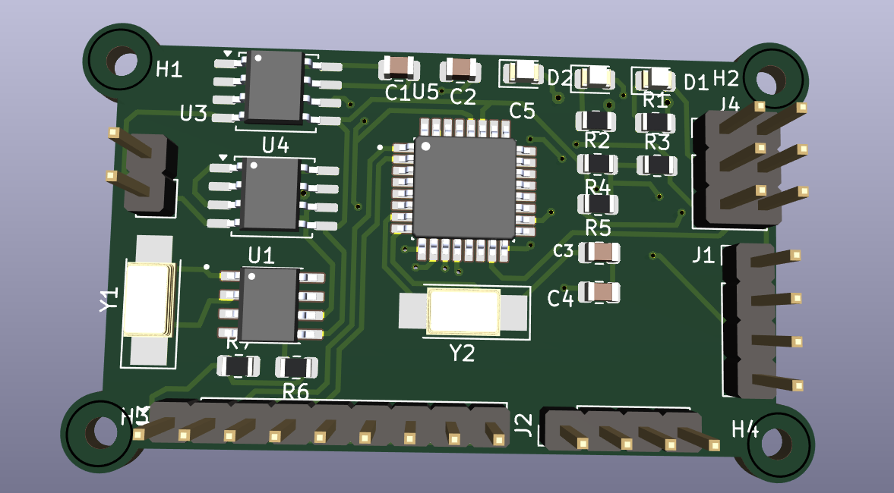
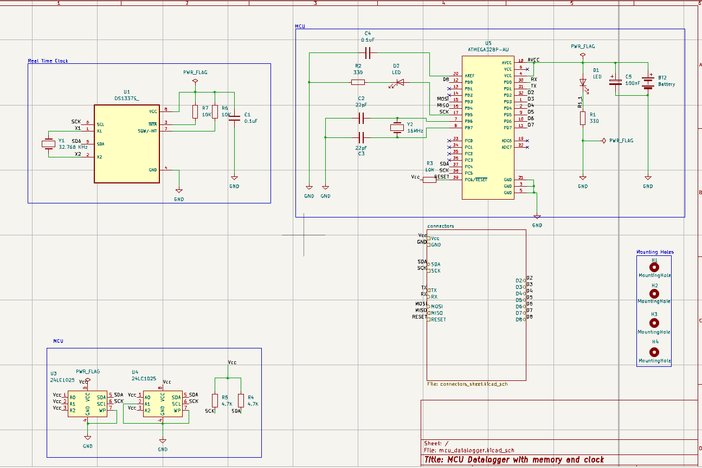

# 📊 ATmega328P Data Logger with EEPROM and RTC

A low-power, offline data logger built using the **ATmega328P** microcontroller. It logs sensor data to a 512KB external I2C EEPROM, timestamped using a DS3231 RTC. Ideal for **environmental monitoring**, **industrial logging**, or **DIY electronics** where low power and reliability matter.

---

## 🖼️ Assembled Hardware

---

## 🔧 Features

- ✅ Microcontroller: **ATmega328P @ 16 MHz**
- 📦 Memory: **512KB External EEPROM (24LC512)**
- 🕒 Timekeeping: **DS3231 Real-Time Clock**
- 📝 Data Logging: Accurate timestamps with each entry
- 🔌 Interfaces: **I2C** (EEPROM & RTC), **UART** (debug/data dump)
- 💾 Power Efficient: Sleep modes supported
- 🔄 Circular or sequential EEPROM writing (configurable)
- 📠 UART Command Interface:
  - `LOG` – Start logging
  - `DUMP` – Dump stored data
  - `CLR` – Clear EEPROM

---

## 🛠️ Hardware Used

| Component      | Description                      |
|----------------|----------------------------------|
| ATmega328P     | 8-bit AVR microcontroller         |
| 24LC512        | 512KB I2C EEPROM                  |
| DS3231         | Real-Time Clock Module            |
| 16 MHz Crystal | External oscillator for MCU       |
| 22pF Capacitors| For crystal stabilization         |
| 100nF Capacitors | Decoupling for VCC              |
| I2C Pull-ups   | 4.7k–10kΩ on SDA/SCL              |
| UART Header    | For serial interface              |
| Power Supply   | 5V regulated                      |

---

## 🧑‍💻 Firmware Features

- Written in C using **AVR-GCC** and **AVR Libc**
- I2C Master driver for EEPROM and RTC
- UART command interface with interrupt-driven RX
- Optional EEPROM wear-leveling logic
- Time/date initialization via UART or hardcoded config
- Supports both **circular** and **linear logging modes**

---

## 📂 Project Folder Structure

.
├── src/
│ ├── main.c
│ ├── rtc.c / rtc.h
│ ├── eeprom.c / eeprom.h
│ ├── uart.c / uart.h
│ └── utils.c / utils.h
├── include/
├── schematics/
│ ├── datalogger_board.png <- Board photo
│ └── datalogger_schematic.pdf <- Full circuit diagram
├── Makefile
└── README.md

---

## 📐 Schematics

-  

---

## 🚀 Usage (UART Commands)

Once flashed and running, use a UART terminal (e.g., PuTTY, Minicom):

| Command | Function               |
|---------|------------------------|
| `LOG`   | Start data logging     |
| `DUMP`  | Print all stored logs  |
| `CLR`   | Clear EEPROM memory    |

---

## ⚡ Power Modes

- Uses **AVR sleep modes** between logging intervals
- Ideal for **battery-powered deployments**

---

## 🧩 Future Ideas

- Add SD card support for long-term storage  
- Add sensors (e.g., DHT22, BMP280) via I2C  
- Enable wireless sync via BLE or ESP8266  

---

## 📜 License

This project is open-source under the **MIT License**. See `LICENSE` file for details.

---

## 👨‍💻 Author

**Muhammed S**  
[GitHub](https://github.com/muhammedsaifudeen) • Embedded Systems Developer
